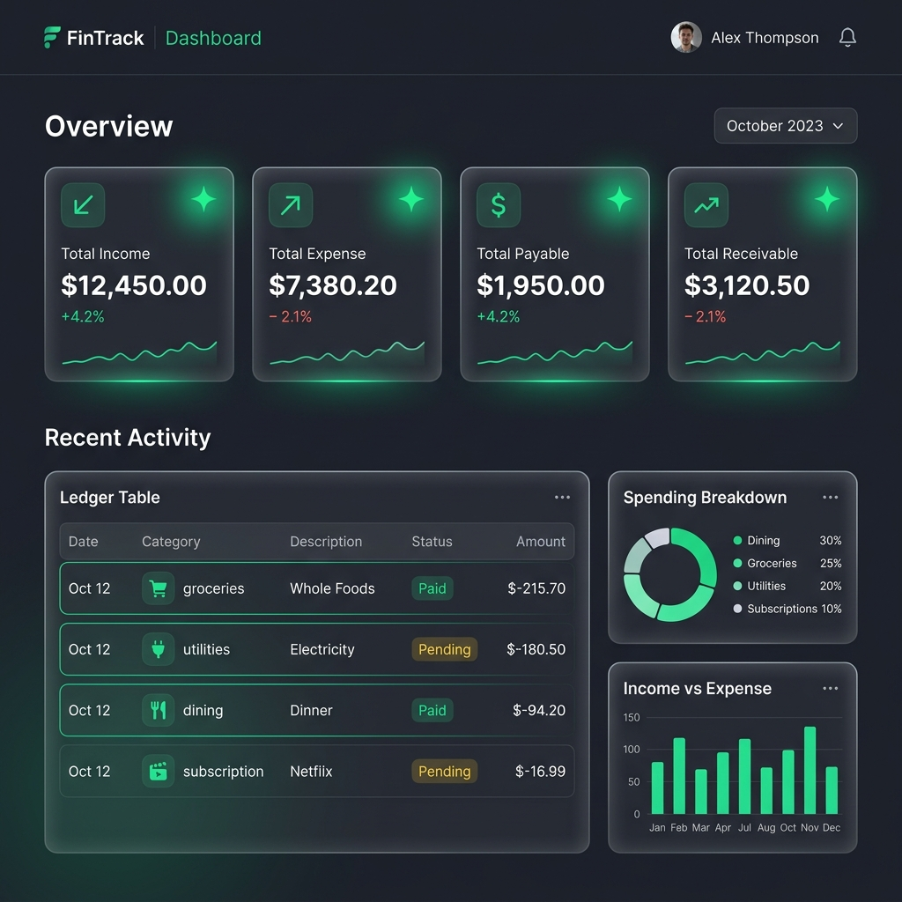

# ✨ Expense Tracker | Modern Financial Ledger



> **The most elegant way to manage your finances.** Track your Income, Expenses, Payables (Dena), and Receivables (Pawna) with a premium, glassmorphic interface.

---

## 🚀 Overview

**Expense Tracker** is a state-of-the-art financial management application built with **Next.js 15**. It empowers users to take full control of their money through an intuitive dashboard, secure authentication, and detailed transaction history. Whether you're tracking daily coffee runs or complex receivables, our modern ledger keeps you organized.

### 🌟 Key Features

*   **🔒 Secure Google Auth**: Login effortlessly with your Google account via NextAuth.
*   **📊 Financial Dashboard**: Real-time summary cards for Income, Expenses, Payables, and Receivabes.
*   **📂 Filterable Ledger**: Navigate through your transactions using 4 dedicated tabs (Income, Expense, Payable, Receivable).
*   **⚖️ Running Balance**: See your cumulative balance after every transaction to stay on top of your net worth.
*   **💎 Premium Aesthetics**: A dark-mode, glassmorphic design system using Tailwind CSS and the Outfit font for a high-end feel.
*   **📱 Fully Responsive**: Seamless experience across mobile, tablet, and desktop.

### 🍱 Category Breakdown
| Category | Logic | Use Case |
| :--- | :--- | :--- |
| **Income** | (+) Increases Balance | Salary, Dividends, Transfers In |
| **Expense** | (-) Decreases Balance | Food, Rent, Entertainment |
| **Receivable** | (+) Increases Balance | Money others owe you (**Pawna**) |
| **Payable** | (-) Decreases Balance | Money you owe others (**Dena**) |

---

## 🛠 Tech Stack

| Technology | Purpose |
| :--- | :--- |
| **Next.js 15** | React Framework (App Router) |
| **Prisma** | Modern ORM for Type-Safe DB access |
| **SQLite** | Lightweight, high-performance database |
| **NextAuth.js** | Enterprise-grade Authentication |
| **Tailwind CSS** | Utility-first CSS with Custom Glassmorphism |
| **Lucide React** | Beautifully crafted iconography |
| **Zod** | Schema-based validation |

---

## 🛠 Developer Setup

Follow these steps to get the project running locally on your machine.

### 1. Prerequisites
*   [Node.js 20+](https://nodejs.org/)
*   npm / pnpm / yarn

### 2. Clone the Repository
```bash
git clone https://github.com/SamratEmily/expense-tracker.git
cd expense-tracker
```

### 3. Install Dependencies
```bash
npm install
```

### 4. Configuration (`.env`)
Create a `.env` file in the root directory and add the following:

```env
# NextAuth configuration
NEXTAUTH_SECRET="your-secret-here"
NEXTAUTH_URL="http://localhost:3000"

# Google OAuth
GOOGLE_CLIENT_ID="your-google-client-id"
GOOGLE_CLIENT_SECRET="your-google-client-secret"

# SQLite configuration
DATABASE_URL="file:./dev.db"
```

> [!TIP]
> You can generate a NextAuth secret using `openssl rand -base64 32`.

### 5. Database Initialization
```bash
npx prisma db push
npx prisma generate
```

### 6. Run the Development Server
```bash
npm run dev
```
Visit [http://localhost:3000](http://localhost:3000) to see your app in action!

---

## 💾 Data Model

The application uses Prisma with a SQLite backend. Key models include:

- **User**: Handled by NextAuth (Google Provider).
- **Transaction**: Stores description, amount, category, and user relationship.
- **Category**: Enum containing `INCOME`, `EXPENSE`, `RECEIVABLE`, `PAYABLE`.

---

## 📂 Project Structure

```text
src/
├── app/              # Next.js App Router (Layouts, Pages, APIs)
│   ├── api/          # Serverless functions (Auth, Transactions)
│   ├── dashboard/    # Main user interface
│   └── globals.css   # Global styles & design tokens
├── components/       # Reusable UI components
├── lib/              # Shared utilities (Prisma client, etc.)
└── prisma/           # Database schema & migrations
```

---

## 📈 Roadmap
- [ ] Weekly/Monthly analytical charts.
- [ ] Multi-currency support.
- [ ] Export ledger as PDF/CSV.
- [ ] Budget goals & notifications.

---

## 📄 License
Distributed under the MIT License. See `LICENSE` for more information.

---

**Built with ❤️ for better financial clarity.**
